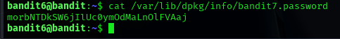

## Bandit Level 06 → Level 07

### 🎯 Objective
Log in to the Bandit game as bandit6 and obtain the password for the next level by locating a file with specific ownership and size constraints.

### 🔑 Credentials Provided
Username: bandit6  
Password: Obtained from previous level  

### 🔍 Method of Solve
The password for the next level is stored in a file owned by user `bandit7`, belonging to group `bandit6`, and having a size of 33 bytes. The file is located somewhere in the filesystem and requires searching with precise conditions.

### 🧪 Commands Used
- ls -alph  
- find / -type f -user bandit7 -group bandit6 -size 33c  
- cat /var/lib/dpkg/info/bandit7.password  

### 🔑 Next Level Password
morbNTDkSW6jILCO0vmdMaLNnLFVAaj

### 🧠 Explanation
The `ls -alph` command is used to inspect the home directory contents.  
The `find / -type f -user bandit7 -group bandit6 -size 33c` command searches the entire filesystem for a file that matches the given ownership and size criteria.  
During the search, several permission denied messages appear, which are expected when scanning protected directories.  
The correct file is located at `/var/lib/dpkg/info/bandit7.password`.  
The `cat` command is then used to read this file and retrieve the password.

### 🔐 Concept Learned
This level demonstrates advanced file searching using ownership, group, and size filters.  
It highlights how permission errors can be safely ignored while performing system-wide searches and how sensitive information may be stored in system directories.
