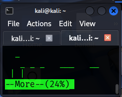

## Bandit Level 26 → Level 27


### 🎯 Objective  

- Log in as `bandit26` using the provided SSH key  
- Escape the restricted pager environment  
- Locate the privileged helper binary  
- Use it to retrieve the password for the next level  


---

### 🧭 Quick Action Summary  

- Connect to the server using the private key  
- Escape the `more` pager into a real shell  
- Locate the `bandit27-do` binary  
- Use it to read the password file  


---

### 🔑 Credentials Provided  

- **Username:** bandit26  
- **Password:** *Obtained from previous level*  
- **Server:** bandit.labs.overthewire.org  
- **Port:** 2220  


---

### 🔍 Method of Solve  

The `bandit26` account logs into a restricted pager environment instead of a normal shell.  
By escaping the pager into a shell, normal command execution becomes possible.  
A helper binary named `bandit27-do` can then be used to execute commands as `bandit27`.

Steps followed:  
- Log in using the SSH private key  
- Escape the pager into a shell  
- Identify the helper binary  
- Use it to read the password file  


---

### 🧪 Commands Used  

- `ssh -i bandit26.sshkey bandit26@bandit.labs.overthewire.org -p 2220`  
- `:set shell=/bin/bash`  
- `:shell`  
- `ls`  
- `./bandit27-do`  
- `./bandit27-do cat /etc/bandit_pass/bandit27`  


---

### 🧩 Command Purpose  

| Command | Purpose |
|--------|--------|
| `ssh -i bandit26.sshkey` | Logs in using the SSH private key |
| `:shell` | Escapes the pager into a real shell |
| `bandit27-do` | Executes commands as user `bandit27` |
| `cat /etc/bandit_pass/bandit27` | Displays the next level password |


---

### 📸 Screenshot Evidence  

 

  


---

### 🔑 Next Level Password  

```
upsNCc7vzaRDx6oZC6GiR6ERwe1MowGB
```


---

### 🧠 Explanation  

- The SSH key allows login but opens a restricted pager  
- The pager can be escaped into a full shell  
- The `bandit27-do` binary runs commands as `bandit27`  
- Using it reveals the password from the system file  


---

### 🔐 Concept Learned  

This level demonstrates restricted environment bypassing.  
It shows how pagers and helper binaries can be exploited to gain higher privileges.


---

### 🛡️ Security Insight  

Restricted shells and pagers must be carefully hardened.  
Helper binaries that execute commands as other users can lead to privilege escalation if misused.
