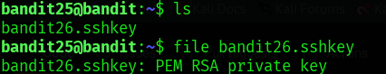

## Bandit Level 25 → Level 26


### 🎯 Objective  

- Log in as `bandit25`  
- Obtain the SSH private key  
- Access the restricted `bandit26` account  
- Escape the restricted shell  
- Retrieve the password for the next level  


---

### 🧭 Quick Action Summary  

- Login as `bandit25`  
- Copy the SSH private key  
- Connect as `bandit26`  
- Trigger the `more` pager  
- Escape into a Bash shell  
- Read the password  


---

### 🔑 Credentials Provided  

- **Username:** bandit25  
- **Password:** iCi86ttT4KSNe1armKiwbQNmB3YJP3q4  


---

### 🔍 Method of Solve  

The `bandit26` account uses a restricted program instead of a normal shell.  
By triggering the `more` pager and escaping into Vim, a real Bash shell can be spawned.

Steps followed:  
- Copy the SSH private key  
- Log in as `bandit26`  
- Force `more` into interactive mode  
- Escape to Vim  
- Launch a Bash shell  
- Read the password file  


---

### 🧪 Commands Used  

- `ls`  
- `file bandit26.sshkey`  
- `scp -P 2220 bandit25@bandit.labs.overthewire.org:/home/bandit25/bandit26.sshkey .`  
- `chmod 600 bandit26.sshkey`  
- `ssh -i bandit26.sshkey bandit26@bandit.labs.overthewire.org -p 2220`  
- `v`  
- `:set shell=/bin/bash`  
- `:shell`  
- `cat /etc/bandit_pass/bandit26`  


---

### 🧩 Command Purpose  

| Command | Purpose |
|--------|--------|
| `scp` | Copies the private key from the remote server |
| `ssh -i` | Logs in using the private key |
| `v` | Opens Vim from the pager |
| `:shell` | Launches a real shell from Vim |
| `cat bandit26` | Reads the next level password |


---

### 📸 Screenshot Evidence  

**Step 1 – Locating the SSH Private Key**  


**Step 2 – Copying the Key Using SCP**  


**Step 3 – Logging in and Triggering the `more` Pager**  


**Step 4 – Escaping to Vim and Opening a Bash Shell**  


**Step 5 – Reading the Next Level Password**  


---

### 🔑 Next Level Password  

```
0773xxkkOMxfdqOfPRv9L3jBUOGCZ
```


---

### 🧠 Explanation  

- The private key allows access to `bandit26`  
- The restricted program launches the `more` pager  
- `more` can be escaped into Vim  
- Vim allows spawning a full shell  
- The password is read from the system directory  


---

### 🔐 Concept Learned  

This level demonstrates how restricted shells can be bypassed.  
It shows how pagers and editors can be abused to gain full command-line access.


---

### 🛡️ Security Insight  

Restricted environments must prevent editor escapes.  
Otherwise, attackers can bypass sandboxed shells and gain full control.
